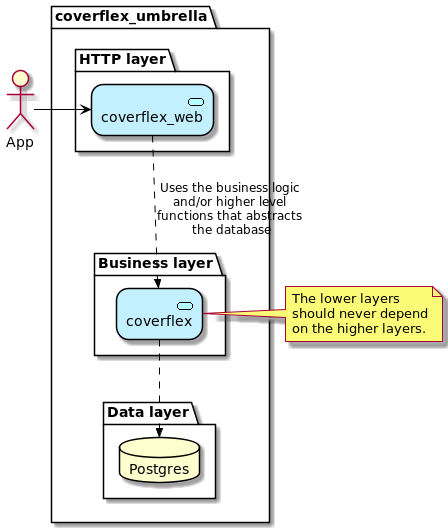

# Coverflex challenge

As we can see on the HLD bellow shows this project is an umbrella application with two applications.



* coverflex - Here is where the business logic and database related operations lives
  
* coverflex_web - Here is just the rest API that interact with the `coverflex` layer 

## Business logic

The most complex business logic can be found in the function [Coverflex.Orders.buy_products](./apps/coverflex/lib/coverflex/orders.ex),
this is just an orchestration function that call other functions where each one do **only one thing**, we use the
[ecto Multi](https://hexdocs.pm/ecto/Ecto.Multi.html) to create the logic chain and put everything inside a database
transaction.

## Redirects

To avoid the user to see a not found page when try to access the index(/) we redirect the request to the
`Routes.product_path(conn, :index)` path.

## Running tests

You can run the tests with the default Elixir mix command `mix test` or with the test watch `mix test.watch` that will
execute all the tests when a file change detected.

## Examples

* List products

```shell
http http://localhost:4000/api/products
```

* Create a user

This endpoint can be used to create or get a user.

> This endpoint violates the [HTTP method GET](https://developer.mozilla.org/en-US/docs/Web/HTTP/Methods/GET) definition
> that says this method is [safe](https://developer.mozilla.org/en-US/docs/Glossary/Safe) and [idempotent](https://developer.mozilla.org/en-US/docs/Glossary/Idempotent).

> All the new user receives a initial balance of 500.

```shell
http http://localhost:4000/api/users/eltonplima
```

* Get a user

```shell
http http://localhost:4000/api/users/eltonplima
```

* Create an order

```shell
http POST http://localhost:4000/api/orders order:='{"items": ["6ac48892-baac-49f2-a86e-8976720f0dbf"], "user_id": "eltonplima"}'
```

## Possible errors on requests

You can see all the possible errors in the [fallback view](./apps/coverflex_web/lib/coverflex_web/controllers/fallback_controller.ex).
